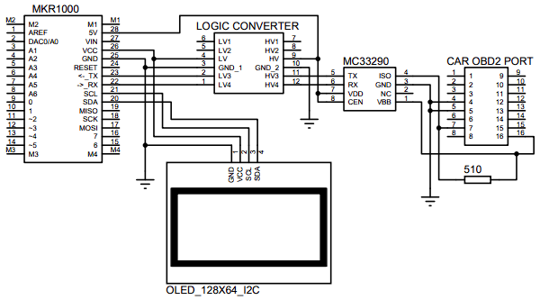
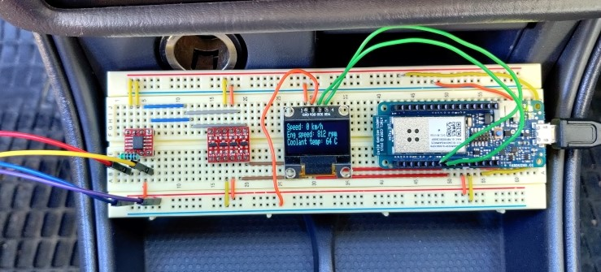
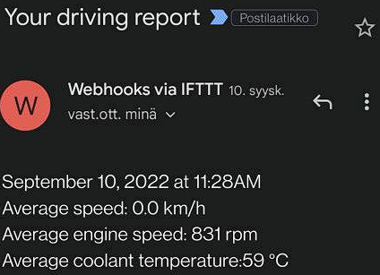

# OBD-info-display
Car info display with online connectivity

## About
This project demonstrates how Arduino MKR1000 can be used to read data from a
car OBD2 port and to display data on OLED screen. In addition, the wifi
connectivity of the MKR1000 is utilized to send a driving report via email
after the driving session.

The hardware is operational with cars that use ISO 9141 (K-line) protocol for
signaling the data. MC33290 K-line transceiver with
[OBD9141](https://github.com/iwanders/OBD9141) library is used to communicate
between Arduino and the vehicle K-line. Since MKR1000 operates at 3.3V, logic
level converter is needed between Arduino and MC33290.

## Schematic

## Hardware

## Driving Report
In addition to the real time data on the OLED screen, a driving report will be
sent automatically via email after the driving session has finished.
(Engine turned off)

Arduino MKR1000 can be set up to connect to the internet for example via a cell
phone mobile hotspot or via a home wifi network that has coverage over the
garage where the car will be parked.

A web service called [Ifttt](https://ifttt.com/explore) is used to send the
email. In Ifttt, a user can configure certain events to trigger different
actions. In this case, a web request to a certain url by Arduino MKR1000
triggers an email sending.

